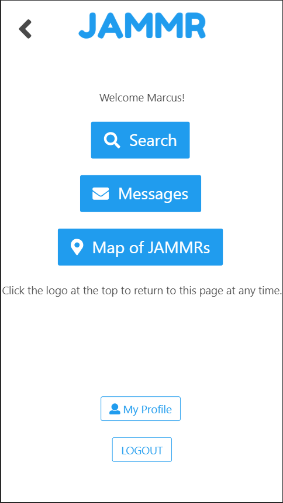
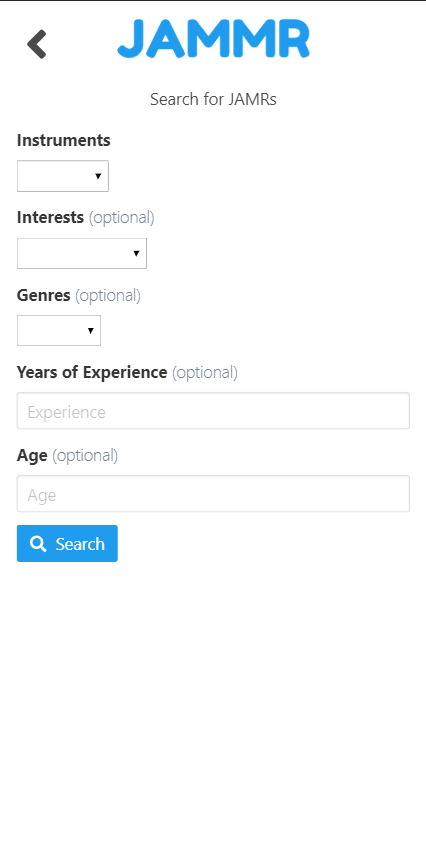

# This project is deployed at the following link:
As of 3/31/18, this site is styled for web use and mobile use, however I am encountering a bug where (in web view) the text input on the conversation page is refusing to stay inside of the body tag. It extends all of the way across the page, which looks very funny. This is a known bug I am working on. Overall Jammr does display better in a mobile perspective, either viewed on a mobile device, or using a mobile device perspective in Chrome Dev Tools. 

[JAMMR.com](https://fec-jammr.firebaseapp.com/)

# How to Use the app:
1. Create a new account by registering with a email/pw, and you will be taken directly to the profile editing page to create your new profile.
  - OR - 
  Log in using an account I have made available to testers: 
  email: `z@z.com` 
  pw: `aaaaaa`
2. Click the 'JAMMR' logo at the top to go back to the Home Page at any time
3. Click the Back arrow in the top left corner to go back from any page (does not work on Search Results page. Once the results page has been left, those results are gone, and you must re-search to see those results again). The back button is literally calling the browsers 'back' method to go backwards 1 page in your browser history. 
4. The home page has three links: 

  i. `Search` (which brings you to a search form to search for other users)
  
  
    
  ii. `Messages` (which opens up your list of message conversations similar to your text messages app on iPhone/Android) 
  
  
  
  iii. `Map` (which will show you a map of nearby users using Google Maps API).
  
  
  
5. All current users in JAMMR are fictional accounts. Almost all users are also located in Nashville, TN. There are currently only ~25 users in the database, so the more filters you select on the `Search` page, the less users will be returned in search results. In order to see more users, select fewer filters. Try searching for just `drums` using the dropdown menu to see many results. 

    

6. To view the map of other JAMMRs in Nashville, click the Map button on the Home Page. 
7. On the Map Page, click on a pin to see who that user is, a bit about them, and then click 'View Profile' at the bottom of the info window to go directly to that users profile in JAMMR. 
8. View any open conversations with other users by clicking the Messages button on the Home Page. Here you can see any messages you have available from other users, as well as if there are any new messages available! 

    

9. Click on a conversation in the Messages List to open that conversation and view all of its messages.  
10. Have fun! and Thanks for checking out my app!
 

# This was my goal before I built this app:

## Front-End-Capstone
This is my Front End Capstone Project at Nashville Software School. We were given creative freedom to build anything we wanted. This was my first time using AngularJS. 

## JAMMR
My goal is create a web/ mobile app called JAMMR where users can look for other musicians nearby to play with. 

1. Users can make an account using Google authentication.
2. Users can create a profile with relevant information such as: 
  i. instruments they play
  ii. What they are looking for (eg: specific other-instrument players, starting a band, certain genres, just a "jam", etc.)
  iii. Their age, location, other slightly-personal information
  iv. Whether they have a play to play loud music (like a practice space)
  v. Their skill level at their instrument
  vi. Whether they are a professional, amateur, or hobbyist
3. Users can search for other users based on any of the profile information above.
4. Users can contact each other through in-app chat system to talk to each other.

Post-MVP Goals: 
1. Users can see a map with "approximate" locations of other users online. 
2. Users can see a "feed" such as 'nearby musicians' filtered by their preferred search criteria.
3. Users can see a feed with posts from other users advertising themselves as 'currently looking to meet up literally right now'.
  i. Other users would get a push notification of these posts and would be able to directly contact the user who posted.
4. An open chat room where people can post anything they want to.
  i. ideally, this would only be implemented for an "area", and users would have to subscribe to an "area", which would be the city they live in. That way I could filter the messages they see, based on which area they are in.
5. Possibly enable Reachability, to indicate to users, whether other users are currently online.

# To run this Repo Locally:
1. clone this repo onto your machine as a new project
2. run npm install
3. run grunt in your terminal from the root of this repo, AND run a local server.
4. open the local server in Chrome, and for best visual results, use mobile device perspective mode in Chrome Dev Tools, or resize the Chrome window to a mobile phone-shaped size. I originally styled the project using the iPhone X Device size in the Chrome Dev Tools.

